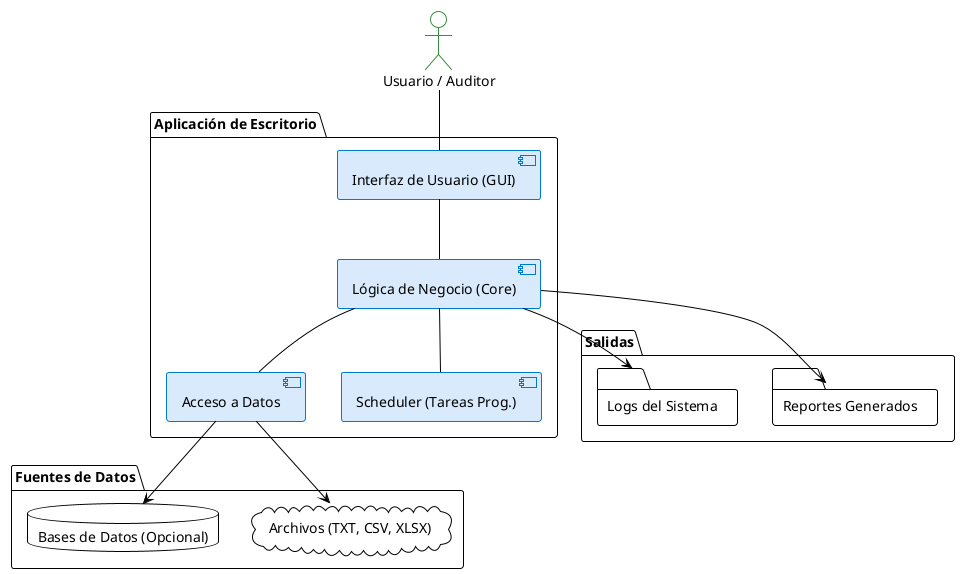

# Arquitectura del Sistema

Este documento describe la arquitectura actual y la visión a futuro del proyecto de automatización de datos de Capresoca.

---

## 1. Estructura Actual: Híbrida (Notebooks + Módulos)

La arquitectura actual es un modelo híbrido diseñado para facilitar la exploración y el desarrollo iterativo.

-   **`/notebooks` (Capa de Prototipado y Exploración)**:
    -   Contiene los flujos de trabajo de negocio en formato de Jupyter Notebooks.
    -   Es el entorno principal para probar hipótesis, validar la lógica contra los datos reales y desarrollar los pasos de los procesos de negocio (ej. validaciones de Aseguramiento, reportes para ADRES).
    -   **Ventaja**: Permite un desarrollo rápido y una visualización directa de los resultados intermedios.
    -   **Desventaja**: No es un entorno robusto para producción ni para ejecuciones automatizadas.

-   **`/src` (Capa de Lógica Reutilizable)**:
    -   Contiene módulos de Python (`.py`) con funciones y clases estables y reutilizables.
    -   Estos módulos son el resultado de refactorizar la lógica validada en los notebooks.
    -   **Ejemplos**: `file_loader.py` para la carga de datos, `data_cleaning.py` para la limpieza.
    -   **Objetivo**: Construir una librería interna de componentes de negocio.

El flujo de trabajo típico es:
1.  **Explorar y prototipar** una solución en un notebook.
2.  **Validar** la lógica y los resultados.
3.  **Refactorizar** el código funcional en módulos reutilizables dentro de `src`.

---

## 2. Visión a Futuro: Aplicación de Escritorio Modular

La arquitectura objetivo es una aplicación de escritorio para Windows con una clara separación de responsabilidades, siguiendo un modelo de tres capas.

-   **Capa de Presentación (Interfaz de Usuario)**:
    -   Una interfaz gráfica (GUI) sencilla que permitirá a los usuarios configurar y ejecutar tareas.
    -   Mostrará el estado de los procesos y permitirá visualizar los resultados o reportes generados.
    -   *Tecnología a definir (ej. PyQt, Tkinter, etc.)*.

-   **Capa de Lógica de Negocio (Core)**:
    -   El corazón de la aplicación, orquestando los flujos de trabajo.
    -   Contendrá los módulos de `src` maduros.
    -   Gestionará las tareas programadas (usando un scheduler) y las tareas iniciadas por el usuario.

-   **Capa de Acceso a Datos**:
    -   Componentes responsables de interactuar con las fuentes de datos: leer archivos (locales, red), conectarse a bases de datos si es necesario, y escribir los resultados.

### Diagrama Conceptual de la Arquitectura Objetivo

