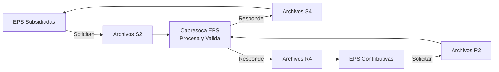
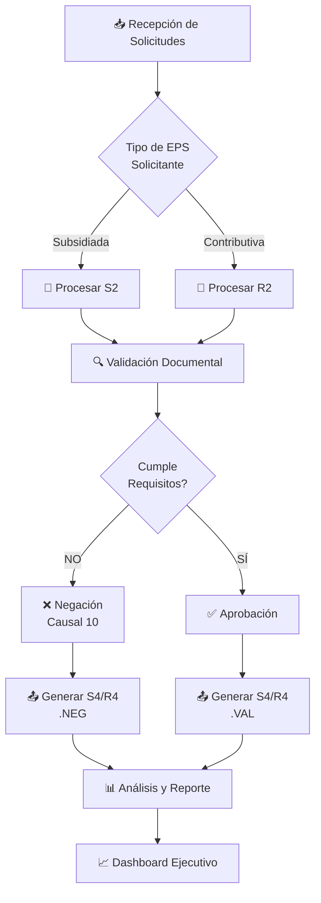
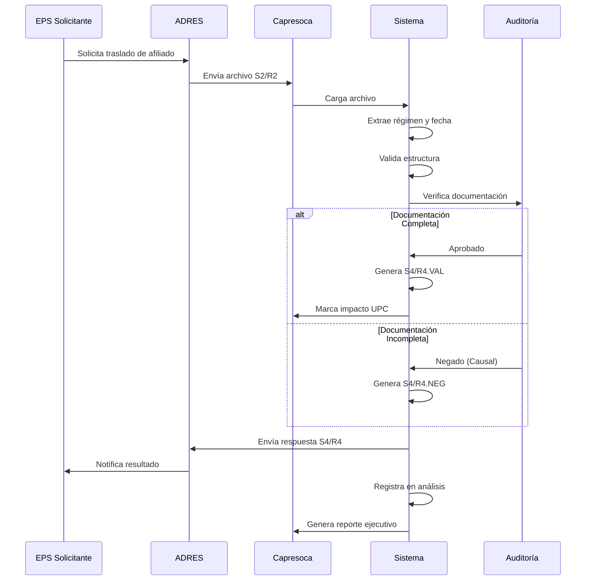
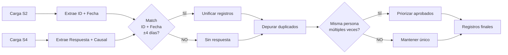
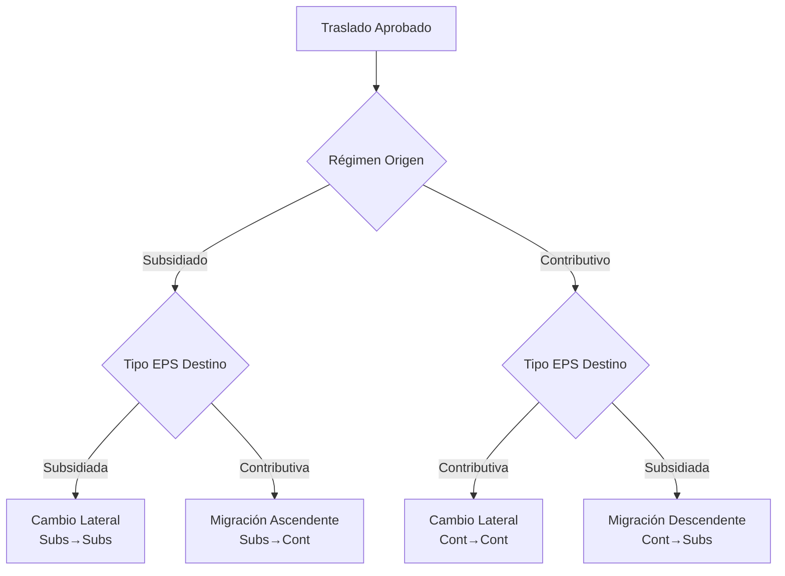
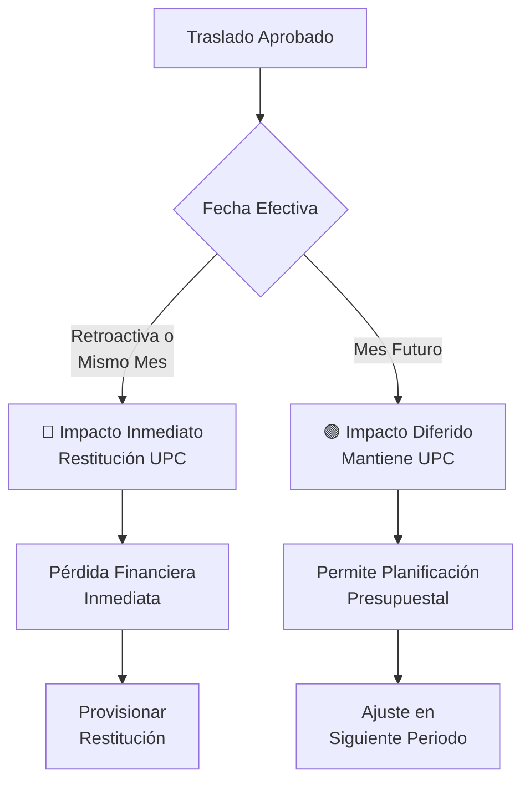

# Proceso de Traslados de Salida - Capresoca EPS

## 📋 Índice
1. [Descripción General](#descripción-general)
2. [Tipos de Archivos](#tipos-de-archivos)
3. [Flujo de Proceso](#flujo-de-proceso)
4. [Estructura de Datos](#estructura-de-datos)
5. [Lógica de Validación](#lógica-de-validación)
6. [Categorización](#categorización)
7. [Impacto Financiero](#impacto-financiero)
8. [Análisis y Reporte](#análisis-y-reporte)

---

## Descripción General

El proceso de traslados de salida gestiona las solicitudes de otras EPS para trasladar afiliados desde Capresoca EPS hacia sus entidades. Este proceso está regulado por la **Resolución 762 de 2023** y maneja dos flujos paralelos según el régimen de la EPS solicitante:

### Flujos de Entrada



**Todos los archivos (S2, S4, R2, R4) representan SALIDAS de afiliados de Capresoca EPS**

---

## Tipos de Archivos

### 📥 Archivos de Solicitud (Entrada)

#### **S2 - Solicitudes de EPS Subsidiadas**
- **Origen**: EPS del régimen **subsidiado**
- **Contenido**: Solicitudes de traslado de afiliados de Capresoca (tanto EPS025 como EPSC25)
- **Formato**: Archivos .TXT con separación por comas
- **Encoding**: ANSI (latin-1)
- **Frecuencia**: 2-4 veces al mes (procesos de ADRES)
- **Nomenclatura**: `S2EPSC25DDMMYYYY.TXT` o `S2EPS025DDMMYYYY.TXT`

#### **R2 - Solicitudes de EPS Contributivas**
- **Origen**: EPS del régimen **contributivo**
- **Contenido**: Solicitudes de traslado de afiliados de Capresoca (tanto EPS025 como EPSC25)
- **Formato**: Archivos .TXT con separación por comas
- **Encoding**: ANSI (latin-1)
- **Frecuencia**: 2-4 veces al mes
- **Nomenclatura**: `R2EPSC25DDMMYYYY.TXT` o `R2EPS025DDMMYYYY.TXT`

### 📤 Archivos de Respuesta (Salida)

#### **S4 - Respuestas a EPS Subsidiadas**
- **Destino**: EPS del régimen subsidiado que solicitaron
- **Contenido**: Aprobación (1) o Negación (0) + Causal técnica
- **Formato**: Archivos .NEG (negados) y .VAL (aprobados)
- **Plazo**: 1-4 días después de recibir S2
- **Nomenclatura**: `S4EPSC25DDMMYYYY.NEG` / `S4EPSC25DDMMYYYY.VAL`

#### **R4 - Respuestas a EPS Contributivas**
- **Destino**: EPS del régimen contributivo que solicitaron
- **Contenido**: Aprobación (1) o Negación (0) + Causal técnica
- **Formato**: Archivos .NEG (negados) y .VAL (aprobados)
- **Plazo**: 1-4 días después de recibir R2
- **Nomenclatura**: `R4EPSC25DDMMYYYY.NEG` / `R4EPSC25DDMMYYYY.VAL`

---

## Flujo de Proceso

### Diagrama de Flujo General



### Proceso Detallado



---

## Estructura de Datos

### Columnas Principales

#### Archivos S2
| Columna | Descripción | Ejemplo |
|---------|-------------|---------|
| 0 | ID del afiliado | 123456789 |
| 1 | Código EPS solicitante | EPS005 |
| 8 | Código departamento destino | 85, 50, 11 |
| 9 | Código municipio destino | 85001 |
| 11 | Fecha efectiva traslado | 01/11/2025 |
| regimen | Régimen Capresoca (Subsidiado/Contributivo) | Subsidiado |
| fecha_proceso | Fecha del proceso ADRES | 09/01/2026 |

#### Archivos R2
| Columna | Descripción | Ejemplo |
|---------|-------------|---------|
| 0 | ID del afiliado | 987654321 |
| 1 | Código EPS solicitante | EPSS41 |
| 9 | Fecha efectiva traslado | 15/12/2025 |
| 13 | Código departamento destino | 85 |
| 14 | Código municipio destino | 85010 |
| regimen | Régimen Capresoca | Contributivo |
| fecha_proceso | Fecha del proceso ADRES | 16/01/2026 |

#### Archivos S4/R4
| Columna | Descripción | Valores |
|---------|-------------|---------|
| 0 | ID del afiliado | 123456789 |
| 4 (S4) / 5 (R4) | Respuesta | 0=Negado, 1=Aprobado |
| 5 (S4) / 6 (R4) | Causal técnica | 1-15 (Res. 762/2023) |

---

## Lógica de Validación

### Proceso de Unificación S2-S4



### Reglas de Negocio

1. **Ventana de Respuesta**: Las respuestas (S4/R4) deben estar entre 1-4 días después de la solicitud (S2/R2)

2. **Depuración de Duplicados**:
   - Si un afiliado aparece múltiples veces en el mes
   - **Priorizar aprobaciones** sobre negaciones
   - Si todas son negaciones, tomar la más reciente
   - Si todas son sin respuesta, tomar la más reciente

3. **Fecha Efectiva**:
   - Puede ser hasta **2 meses retroactiva** (Res. 762/2023)
   - Puede ser hasta **2 meses posterior**
   - Determina el impacto financiero (UPC)

---

## Categorización

### Tipo de Migración



### Motivo del Traslado

#### 🟣 Dispersión Geográfica (88.8%)
- **Definición**: Departamento destino ≠ 85 (Casanare)
- **Causa**: Cambio de residencia fuera del área de cobertura
- **Evaluación**: **NORMAL** - pérdida esperada
- **Acción**: Monitoreo estadístico

#### 🟢 Solicitud Formal (11.2%)
- **Definición**: Departamento destino = 85 (Casanare)
- **Causa**: Insatisfacción con servicios en territorio propio
- **Evaluación**: **CRÍTICO** - pérdida evitable
- **Acción**: Auditoría y mejora de calidad

---

## Impacto Financiero

### Clasificación por Fecha Efectiva



### Cálculo de Impacto

**Ejemplo:**
- **Proceso**: Enero 2026 (09/01/2026)
- **Fecha efectiva**: 01/11/2025 (retroactiva)
- **Resultado**: Capresoca debe **devolver 3 meses de UPC** (noviembre, diciembre, enero)

**Meta organizacional**: Mantener impacto inmediato **< 20%**

---

## Análisis y Reporte

### Indicadores Clave (KPIs)

#### 1. Tasa de Aprobación
```
Tasa = (Aprobados / Total Solicitudes) × 100
Meta: ≥ 25% (normativo)
```

#### 2. Migración Interna Crítica
```
Migración Interna = (Salidas Depto 85 / Total Salidas) × 100
Meta: < 15% (controlado)
```

#### 3. Impacto Financiero
```
Impacto Inmediato = (Restitución UPC / Total Aprobados) × 100
Meta: < 20%
```

#### 4. Concentración Competitiva
```
Concentración = (Top 2 EPS / Total Salidas) × 100
Meta: < 60%
```

### Dashboard Ejecutivo

El análisis genera un tablero de control con 10 secciones:

1. **KPIs Principales**: Métricas de alto nivel
2. **Matriz de Migración**: Flujos origen→destino
3. **Tipo de Migración**: Lateral vs ascendente
4. **Distribución Geográfica**: Departamentos destino
5. **Top EPS Destino**: Competidores principales
6. **Categorías**: Dispersión vs Solicitud formal
7. **Impacto Financiero**: Inmediato vs Diferido
8. **Tasa de Aprobación**: Solicitudes vs aprobadas
9. **Migración Interna**: Análisis crítico Casanare
10. **Resumen Ejecutivo**: Conclusiones y recomendaciones

### Salida del Análisis

**Archivos generados:**
- `df_salidas_total`: Dataset unificado completo
- `df_aprobados`: Solo traslados aprobados para análisis
- Dashboard interactivo (Plotly)
- Resumen ejecutivo (texto)

---

## Alertas y Acciones

### Matriz de Criticidad

| Indicador | 🟢 Normal | 🟡 Atención | 🔴 Crítico |
|-----------|-----------|-------------|------------|
| Tasa aprobación | ≥70% | 50-70% | <50% |
| Migración interna | <15% | 15-30% | >30% |
| Impacto inmediato | <15% | 15-30% | >30% |
| Dispersión geográfica | >60% | 40-60% | <40% |

### Plan de Acción Estándar

#### 🔴 URGENTE (< 7 días)
- Auditar municipios con >5 salidas
- Encuestas de satisfacción a afiliados que se trasladaron
- Revisión de IPS en zonas críticas

#### 🟡 IMPORTANTE (< 30 días)
- Análisis de causales de negación
- Capacitación a puntos de atención
- Optimización de tiempos de respuesta

#### 🟢 SEGUIMIENTO (< 90 días)
- Monitoreo mensual de tendencias
- Benchmarking con competencia
- Actualización de estrategias territoriales

---

## Referencias Normativas

- **Resolución 762 de 2023**: Marco normativo de movilidad entre EPS
- **Resolución 3778 de 2023**: Procedimientos ADRES
- **Circular 047 de 2023**: Plazos y requisitos documentales
- **Decreto 780 de 2016**: Sistema General de Seguridad Social en Salud

---

## Control de Versiones

| Versión | Fecha | Autor | Cambios |
|---------|-------|-------|---------|
| 1.0 | 04/02/2026 | Coordinación Aseguramiento | Documento inicial |

---

## Contacto

**Área responsable**: Coordinación de Aseguramiento  
**Proceso**: Gestión de Traslados de Salida  
**Frecuencia de actualización**: Mensual
